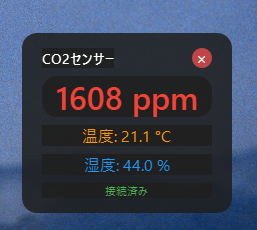

# SCD4XRP2040

CO2センサーSCD4X（ここではSCD41）モジュールをRP2040 Zeroで動かすプロジェクト。
結果はデスクトップウィジェットとして表示

## 概要

このプロジェクトは、SCD4x CO2センサーをRP2040マイコンに接続し、測定データをHIDデバイスとして送信します。Windows PCでデスクトップウィジェットを実行することで、リアルタイムにCO2濃度、温度、湿度を表示できます。

## 機能

### ファームウェア (Firmware/SCD4xRP2040)
- SCD4xセンサーからCO2、温度、湿度を取得
- HIDデバイスとしてPCにデータを送信

### デスクトップウィジェット (DesktopWidget)
CO2濃度、温度、湿度を表示

## 使い方
1. RP2040にファームウェアを書き込む
2. SCD4xセンサーをRP2040に接続(SDA:26, SCL:27)
3. RP2040をPCにUSB接続
4. デスクトップウィジェットを起動
5. CO2濃度、温度、湿度がリアルタイムで表示

## HIDデータフォーマット

センサーデータは6バイトのHIDレポートとして送信されます：

| バイト | 内容 | 形式 |
|--------|------|------|
| 0-1 | CO2濃度 (ppm) | uint16_t (リトルエンディアン) |
| 2-3 | 温度 × 100 (°C) | int16_t (リトルエンディアン) |
| 4-5 | 湿度 × 100 (%) | uint16_t (リトルエンディアン) |

例：`[D2 02 9C 09 30 19]` → CO2: 722ppm, 温度: 24.60°C, 湿度: 64.48%

## デバイス情報

- **VID**: `0x2E8A` (Raspberry Pi)
- **PID**: `0x000A` (RP2040)
- **Usage Page**: `0xFF00` (Vendor-defined)

## プロジェクト構成
- Firmware: RP2040 Zero用 SCD4X→USB HID
- DesktopWidget: Pythonで結果を表示

## ライセンス

このプロジェクトはMITライセンスの下で公開されています。